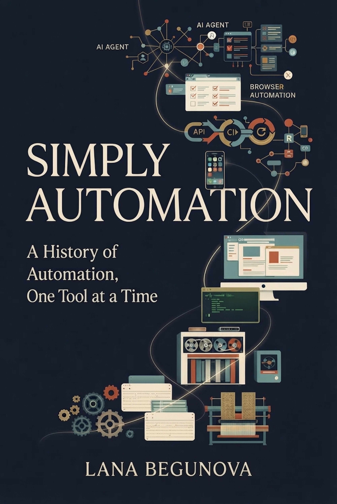

# Simply Automation

### A History of Automation, One Tool at a Time

*By Serene Dipster* · **[Read the book online](https://lana-20.github.io/simply-automation/)** · Free under [CC BY 4.0](LICENSE)

**Simply Automation** is a nonfiction book about the history of automation — told through the tools, technologies, and ideas that changed what machines could do.

The central question is simple:

> **How much of the work can we give to the machine?**

From mechanical looms and punched cards to browser automation, mobile testing, APIs, CI/CD, and AI agents, the book follows the same idea across different eras:

**Repeat → Automate → Program → Integrate → Continuously Execute → Understand → Delegate**

This is a history book disguised as an automation book.

---

## About the Book

Automation did not begin with Selenium.

It did not begin with computers.

And it certainly did not begin with AI.

Long before software existed, people were already trying to make machines repeat work reliably. Every generation moved the boundary a little further:

* Mechanical machines automated physical repetition.
* Programs separated instructions from machines.
* GUI automation taught computers to interact with software.
* Selenium made browser interaction programmable.
* WebDriver turned the browser into infrastructure.
* Appium extended automation to mobile devices.
* API automation moved below the interface.
* Jenkins made automation continuous.
* Playwright made browser automation more context-aware.
* Vibium explores what happens when automation itself becomes a tool for AI agents.

The tools change.

The underlying problem does not.

---

## The Seven Tools

The book follows seven major automation protagonists:

| Tool / Technology            | The Question It Represents                                         |
| ---------------------------- | ------------------------------------------------------------------ |
| **Selenium / UFT**           | Can repetitive user interaction be automated?                      |
| **Selenium WebDriver**       | Can the browser become programmable infrastructure?                |
| **Appium**                   | Can browser automation ideas move to mobile devices?               |
| **API Automation / Postman** | Do we need the UI at all?                                          |
| **Jenkins**                  | Can automation run continuously without a human starting it?       |
| **Playwright**               | Can automation understand more of the browser's state and context? |
| **Vibium**                   | Can automation itself become a tool for machines?                  |

These are not presented as isolated product histories.

They are milestones in the changing **automation boundary** — the line between what humans must do and what machines can reliably do.

---

## Structure

### Part I — Before the Browser

How automation existed before software, and how repetition became instruction.

### Part II — The First Great Test Automation Battle

Selenium, UFT, open source, commercial tools, and the shift from automation products to programmable software.

### Part III — The Browser Becomes Programmable Infrastructure

WebDriver, browser drivers, Grid, locators, waits, Page Objects, and the browser as an automation platform.

### Part IV — Mobile Breaks the Model

Appium, native and hybrid applications, devices, gestures, permissions, network conditions, and the limits of abstraction.

### Part V — Automation Escapes the Test

APIs, Postman, microservices, contracts, and the realization that the UI is only one layer of the application.

### Part VI — Automation Becomes Continuous

Jenkins, CI/CD, pipelines, parallelism, infrastructure, monitoring, and the machine that never stops.

### Part VII — The Machine Starts Reasoning

Playwright, auto-waiting, semantic locators, accessibility, browser context, traces, and the beginning of context-aware automation.

### Part VIII — The Agentic Era

AI agents, MCP, machine-readable tools, deterministic automation, verification, boundaries, and Vibium.

### Part IX — What Seven Tools Reveal

The recurring patterns hidden beneath decades of automation history.

### Part X — The Automation Wars

Buy vs. build, proprietary vs. open source, UI vs. API, Selenium vs. newer approaches, human experience vs. agent experience, and the battle over interfaces.

### Part XI — The Simple Rules

The durable principles that survive changes in tools and technology.

### Part XII — After Automation

What happens when execution becomes cheap, humans move upward, and the question changes from:

> **How do we automate this?**

to:

> **What is worth doing?**

---

## The Core Idea

The history of automation can be summarized as a moving boundary.

At first, machines could repeat physical actions.

Then they could execute instructions.

Then they could operate software.

Then they could operate systems.

Then they could operate continuously.

And now machines are beginning to interpret goals and choose actions.

Each step creates a new question:

**What should the machine be allowed to do next?**

That question is where the history of automation becomes the story of the future.

---

## Repository

```text
book/                 The manuscript, in LaTeX
  prologue/           Prologue — The Machine That Said "Again"
  parts/part-01…12/   Parts I–XII, one chapter each
  epilogue/           Epilogue — What Happens After "Again"?
  appendices/         Timeline, the seven tools, glossary, graveyard, further reading
  cover-front.png     Front cover
  cover-wrap.png      Full wraparound cover (back, spine, front)
  cover/              Print cover: 4x artwork master, build script, fonts, print PDF
site/                 The web edition: build script, styles, assets
docs/                 Generated website (built by site/build.py, not committed)
```

The book is developed in the open. Corrections, suggestions, and translations are welcome as issues or pull requests.

### Reading and building

The web edition is generated from the LaTeX sources with no dependencies beyond Python 3:

```sh
python3 site/build.py      # writes the static site to docs/
open docs/index.html
```

Every push to `main` rebuilds and publishes the site through GitHub Pages (see `.github/workflows/pages.yml`).

Each `.tex` file under `book/` is also a standalone LaTeX document for print; files that use `fontspec` need XeLaTeX or LuaLaTeX.

### Print cover

The print cover is built to the printer's template from a 4x upscale of the cover art (Real-ESRGAN):

```sh
pip install Pillow numpy
python3 book/cover/build_cover.py --pages 152        # 6x9, KDP white paper
python3 book/cover/build_cover.py --spine 0.42       # or the spine width from your printer's template
```

The spine is rebuilt at the exact width for the page count. The barcode box on the back is left clear for the printer's ISBN barcode. Re-run with the final page count once the interior is typeset.

---

## Visual Language

The book's visual identity follows the evolution of automation itself:

**Mechanical → Digital → Programmable → Connected → Continuous → Context-Aware → Agentic**

The illustration system uses a restrained technology-history palette:

* Deep navy
* Warm cream
* Muted teal
* Rust orange
* Subtle antique gold

The goal is not to make the past look futuristic.

It is to show that today's automation is part of a much longer story.

---

## Who This Book Is For

**Simply Automation** is written for people who work with technology — and people who are curious about how technology changes work.

That includes:

* Software testers
* SDETs and QA engineers
* Developers
* Automation engineers
* DevOps engineers
* Software architects
* AI and agent developers
* Engineering leaders
* Technical historians
* Anyone who has ever wondered why we keep automating the same things

You do not need to be an automation expert to follow the story.

You just need to recognize repetitive work.

---

## The Automation Formula

One of the simplest patterns that emerges from the book is:

```text
REPEAT
   ↓
ABSTRACT
   ↓
AUTOMATE
   ↓
OBSERVE
   ↓
VERIFY
   ↓
IMPROVE
   ↓
REPEAT
```

Automation is not a one-time act.

It is a feedback loop.

---

## Why "Simply"?

Because automation history can look complicated when viewed as a collection of tools.

Selenium.

UFT.

WebDriver.

Appium.

Postman.

Jenkins.

Playwright.

Vibium.

But underneath the names are remarkably simple questions:

**What repeats?**

**What can be delegated?**

**At what layer should it happen?**

**How do we know it worked?**

**What happens when the environment changes?**

**What should remain under human control?**

The book tries to make those questions simple without making the history simplistic.

---

## Status

**Complete first edition draft.** All twelve parts, the prologue, the epilogue, and the appendices are written. Revisions, illustrations, and fact-checking continue in the open.

---

## Author

**Serene Dipster** is a pen name.

The book grows out of years of hands-on work with browser automation, mobile automation, APIs, CI/CD, and emerging AI-native testing tools.

---

## License

The text of *Simply Automation* and its original illustrations are licensed under the
[Creative Commons Attribution 4.0 International License](LICENSE) (CC BY 4.0).

You are free to read, share, copy, translate, adapt, and build on this work for any purpose, including commercially, as long as you give credit:

> *Simply Automation* by Serene Dipster, licensed under CC BY 4.0. https://github.com/lana-20/simply-automation

**Exceptions:**

- **Quoted material is not covered by this license.** This includes the chapter epigraphs from Stanisław Lem's *Summa Technologiae*, which remain the property of their copyright holders and are quoted here for commentary.
- **Code** in `site/` is released under the [MIT License](site/LICENSE).
- Product and project names (Selenium, Appium, Jenkins, Playwright, Postman, Vibium, and others) are trademarks of their respective owners and are used here only to discuss their history.

---

## The Question

Automation has spent centuries answering one question:

> **How can a machine do this instead of a human?**

The next question may be more important:

> **Now that the machine can do it, what should the human do?**

**Simply Automation** is an attempt to follow that question from the first punched card to the agentic era.

---

*Simply Automation — A History of Automation, One Tool at a Time.*
*By Serene Dipster*
